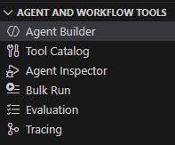
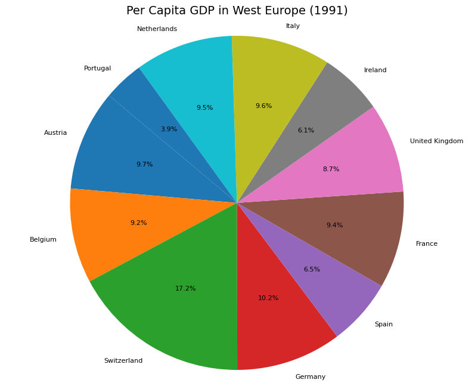
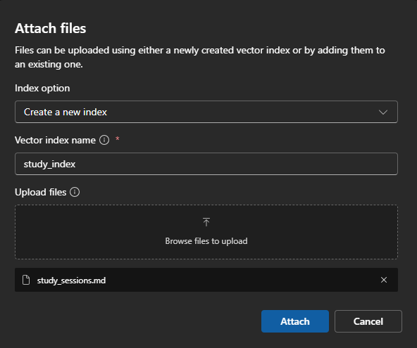
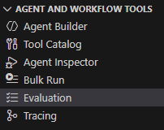
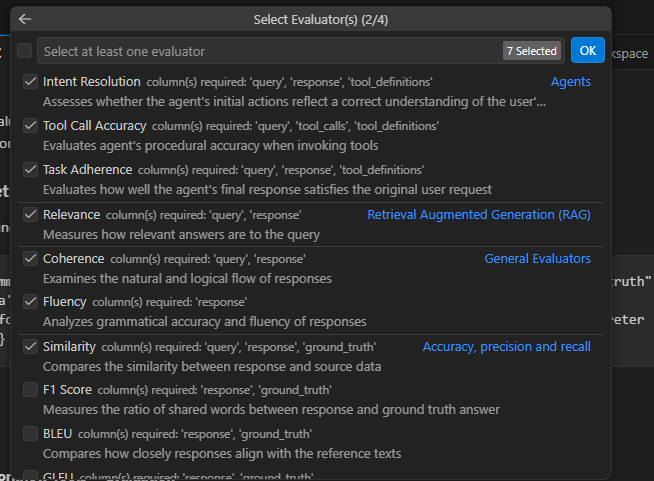
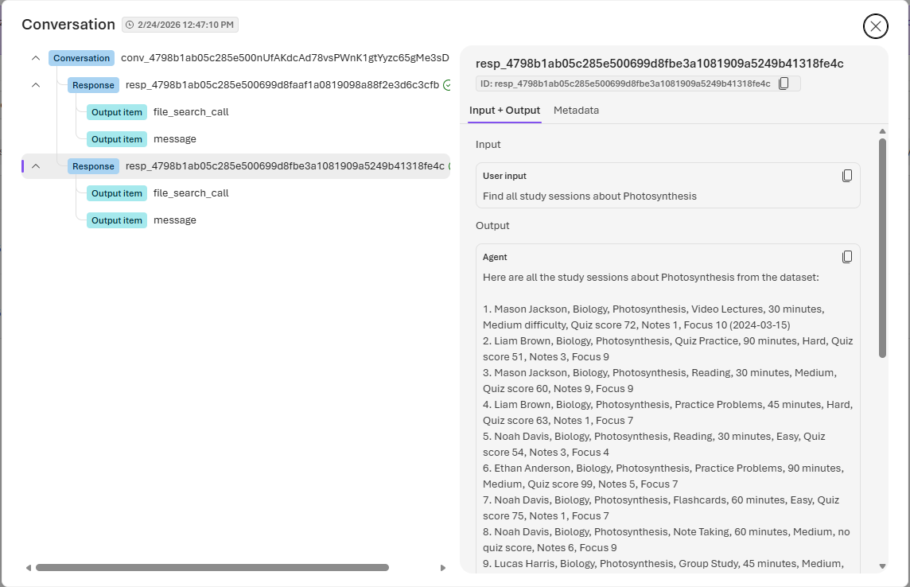

# AI Toolkit. Creating a No-Code Declarative Agent with Agent Builder and Microsoft Foundry

This guide walks through creating a declarative AI agent using VS Code's Agent Builder with Microsoft Foundry - no coding required.



## Table of Contents

- [Prerequisites](#prerequisites)
- [Enable Local Authentication](#important-enable-local-authentication)
- [Creating Your Agent](#creating-your-agent)
- [Tools Overview](#tools-overview)
  - [Code Interpreter](#code-interpreter-tutorial)
  - [Web Search](#web-search)
  - [File Search](#file-search-tutorial)
- [Using Multiple Tools](#using-multiple-tools-together)
- [Local vs Foundry Workflow](#local-vs-foundry-workflow)
- [Evaluation](#evaluation)
- [Tracing](#tracing)
- [References](#references)

## Prerequisites

1. **VS Code** with the following extension installed:
   - [AI Toolkit](https://marketplace.visualstudio.com/items?itemName=ms-windows-ai-studio.windows-ai-studio) (includes Agent Builder)

2. **Azure Subscription** with:
   - An Azure AI Services resource (Cognitive Services)
   - A deployed model (e.g., `gpt-4.1-mini`, `gpt-4o`)

3. **Azure CLI** installed and authenticated (`az login`)

## Important: Enable Local Authentication

Azure AI Services resources may have local authentication (API keys) disabled by default. Agent Builder requires API key access to work properly.

### Check if Local Auth is Disabled

```bash
az cognitiveservices account show \
  --name <your-resource-name> \
  --resource-group <your-resource-group> \
  --query "properties.disableLocalAuth" -o tsv
```

If this returns `true`, you need to enable local auth.

### Enable Local Authentication

```bash
az resource update \
  --resource-group <your-resource-group> \
  --name <your-resource-name> \
  --resource-type "Microsoft.CognitiveServices/accounts" \
  --set properties.disableLocalAuth=false
```

### Verify the Change

```bash
az cognitiveservices account show \
  --name <your-resource-name> \
  --resource-group <your-resource-group> \
  --query "properties.disableLocalAuth" -o tsv
```

This should now return `false`.

> **Note**: If you see the error `"key must be a non-empty string"` in Agent Builder, this indicates local authentication is disabled on your resource.

## Creating the Declarative Agent

### Step 1: Connect to Microsoft Foundry

1. Open VS Code
2. Click on the **AI Toolkit** icon in the Activity Bar (left sidebar)
3. Under **Agent and Workflow Tools**, click **Agent Builder**
4. Sign in to Azure if prompted
5. Select your Microsoft Foundry project/resource

### Step 2: Create a New Agent

1. In Agent Builder, click **Create New Agent** or **+**
3. Configure your agent:
   - **Name**: Give your agent a descriptive name
   - **Model**: Select your deployed model (e.g., `gpt-4.1-mini`)
   - **Instructions**: Define the system prompt that shapes agent behavior

### Step 3: Configure Agent Behavior

In the agent instructions, define:
- The agent's persona and purpose
- Any constraints or guidelines
- Response format preferences

Example instructions:
```
You are a study buddy AI that helps students learn and remember material efficiently. Provide clear explanations, mnemonic techniques, and practice questions. Encourage active recall and spaced repetition in your responses.
```

### Step 4: Add Tools

Enhance your agent with built-in tools to extend its capabilities:

- **Code Interpreter**: Execute Python code for calculations, data analysis, and visualizations
- **File Search**: Search through uploaded documents for retrieval-augmented generation (RAG)
- **Azure AI Search**: Connect to enterprise knowledge bases and indexes
- **Web Search / Bing Search**: Access real-time web information

> **Note**: Function Calling (custom functions for external APIs) requires code-based agents using the Microsoft Agent Framework. It is not available in the no-code declarative agent UI.

> **⚠️ Important**: Foundry tools (Azure AI Search, File Search, Bing Search, etc.) are **only available when your agent is saved to Foundry**. If you save locally, these tools will not appear in the tools selection. To use Foundry tools, you must save your agent directly to your Microsoft Foundry project.

#### Adding Code Interpreter

The Code Interpreter tool allows your agent to write and execute Python code in a sandboxed environment.

**To enable:**
1. In the agent editor, find the **Tools** section
2. Toggle **Code Interpreter** to ON
3. The agent can now:
   - Perform mathematical calculations
   - Analyze data and create visualizations
   - Process uploaded files (CSV, Excel, etc.)
   - Generate charts and graphs

**Sample dataset for testing:**

Download the World Bank GDP per capita dataset:
1. Go to: https://data.worldbank.org/indicator/NY.GDP.PCAP.CD
2. Click **Download** → Select **CSV**
3. Extract the ZIP file - you'll find `API_NY.GDP.PCAP.CD_DS2_en_csv_v2_31.csv`

**Step-by-step tutorial:**

1. Open your agent in the playground
2. Click the **attachment/upload icon** (📎) in the chat input
3. Select the file `API_NY.GDP.PCAP.CD_DS2_en_csv_v2_31.csv`
4. Send this query:
   ```
   Create a pie chart for the year 1991 per capita GDP in West Europe
   ```
5. The agent will:
   - Read and parse the CSV file
   - Filter data for Western European countries in 1991
   - Generate a pie chart visualization
   - Display the chart in the response

**Expected result:**



**More example queries:**
- "Show me the top 10 richest countries in 2023"
- "Create a line chart comparing GDP per capita of USA, China, and Germany over the last 20 years"
- "Calculate the average GDP growth rate for European countries"

#### Adding Web Search

Web Search enables your agent to access real-time web information via Bing.

**To enable:**
1. In the agent editor, find the **Tools** section
2. Toggle **Web Search** to ON

That's it! No additional Azure resources required - the Bing resource is managed by Microsoft.

**How it works:**
1. User sends a query requiring current information
2. Agent searches Bing and retrieves relevant results
3. Agent synthesizes findings into a response with citations

**Step-by-step tutorial:**

1. Open your agent in the playground (with Web Search enabled)
2. Send this query:
   ```
   What are the latest developments in quantum computing in 2026?
   ```
3. The agent will search the web and respond with current information, including source URLs

**More example queries:**
- "What are the latest Azure AI announcements?"
- "Find the current documentation for Azure Cosmos DB"
- "What's the weather in Seattle today?"

##### Web Search vs Grounding with Bing Search

| Aspect | Web Search (Preview) | Grounding with Bing Search (GA) |
|--------|---------------------|--------------------------------|
| Setup | Just enable - no resources needed | Requires creating your own Bing resource |
| Parameters | `user_location`, `search_context_size` | `count`, `freshness`, `market`, `set_lang` |
| Models | Azure OpenAI only | Azure OpenAI + non-OpenAI models |
| Best for | Getting started quickly | Advanced control over search |

> **Note**: Both tools incur additional costs. See [Bing grounding pricing](https://www.microsoft.com/bing/apis/grounding-pricing) for details.

#### Adding File Search

File Search enables retrieval-augmented generation (RAG) by searching through uploaded documents. The agent can find relevant information in your files and use it to answer questions accurately.

**To enable:**
1. In the agent editor, find the **Tools** section
2. Toggle **File Search** to ON
3. Upload files to the agent's knowledge base

**Supported file types:**
- Text: `.txt`, `.md` (recommended for structured data), `.json`
- Documents: `.pdf`, `.docx`, `.pptx`
- Data: `.csv`, `.xlsx`
- Code: `.py`, `.js`, `.html`, `.css`

**Sample dataset for testing:**

Use the included `study_sessions.md` file containing 1000 student study session records:

| Column | Description |
|--------|-------------|
| SessionID | Unique identifier (SS-00001 to SS-01000) |
| Date | Date of study session (2024-2026) |
| StudentName | Student name (15 students) |
| Subject | Subject studied (Biology, Chemistry, Physics, Math, History, Computer Science) |
| Topic | Specific topic within subject |
| StudyMethod | Learning method used (Flashcards, Practice Problems, Reading, etc.) |
| DurationMinutes | Session length (15-180 minutes) |
| Difficulty | Self-reported difficulty (1-5 scale) |
| QuizScore | Post-session quiz score (50-100) |
| NotesPages | Number of notes pages created |
| FocusRating | Self-reported focus level (1-5 scale) |

**Step-by-step tutorial:**

1. Save your agent to Foundry (File Search requires Foundry deployment)
2. Open your agent in the playground
3. In the **File Search** tool settings, click **Upload Files**
4. In the **Attach files** dialog:
   - **Index option**: Select "Create a new index" (or choose an existing one)
   - **Vector index name**: Enter a name (e.g., `study_index`)
   - **Upload files**: Click "Browse files to upload" and select `study_sessions.md`
   - Click **Attach**

   

5. Wait for the file to be processed (indexing may take a moment)
6. Send this query:
   ```
   What subjects did Emma Johnson study?
   ```
7. The agent will search the uploaded data and return Emma's study sessions

**More example queries:**

*Direct lookups (fast):*
- "Find all study sessions about Photosynthesis"
- "What study methods are mentioned in the data?"
- "What happened in session SS-00008?"
- "Show me sessions with quiz score above 95"
- "List Biology sessions from March 2024"

*Analysis queries (may take longer):*
- "Which subject has the highest average difficulty rating?"
- "Compare the effectiveness of Flashcards vs Practice Problems"

**Tips for effective File Search:**
- Keep files well-structured with clear headers
- Use descriptive column names in data tables
- For large datasets, consider splitting into smaller topic-focused files
- Use direct lookups for faster responses; complex aggregations may timeout

#### Managing Multiple Tools

When you enable multiple tools (e.g., Code Interpreter and File Search), the agent may sometimes use the wrong tool for a query. For example, Code Interpreter might attempt to search through study session data, or File Search might be invoked for GDP analysis.

**The Importance of Instructions**

Clear instructions in your agent's system prompt are essential for guiding tool selection. Without explicit guidance, the agent makes its own decisions about which tool to use based on the query - and it may choose incorrectly.

**Example: Separating Study Data from GDP Data**

If your agent has both Code Interpreter (with GDP data) and File Search (with study session data), add these instructions to your agent:

```
Tool usage:
- Use File Search only for study related questions
- Use the Code Interpreter only for the GDP related requests
```

**Best practices for multi-tool agents:**
- Be explicit about which tool handles which domain
- Name your data files descriptively (e.g., `study_sessions.md`, `gdp_data.csv`)
- Test edge cases where tool selection might be ambiguous
- Iterate on instructions based on observed behavior

### Step 5: Test and Deploy

1. Use the built-in playground to test your agent
2. Iterate on instructions based on responses
3. Save and publish when ready

## Local vs. Foundry Workflow

### Local Development (Recommended for Prototyping)

When you save an agent locally in Agent Builder:

| Capability | Available |
|------------|-----------|
| Playground chat testing | ✅ |
| Iterate on instructions | ✅ |
| Debug tool calls | ✅ |
| View token usage | ✅ |
| Git version control | ✅ |
| Offline editing | ✅ |
| Export/Import definitions | ✅ |
| **Foundry tools (Azure AI Search, File Search, Bing Search)** | ❌ |

### Foundry Deployment (Recommended for Production & Tools)

When you save/publish to Microsoft Foundry:

| Capability | Available |
|------------|-----------|
| Production API endpoint | ✅ |
| Multi-user access | ✅ |
| Persistent conversation threads | ✅ |
| Agent evaluation metrics | ✅ |
| **Foundry tools (Azure AI Search, File Search, Bing Search)** | ✅ |
| Integration with knowledge indexes | ✅ |
| Sharing with team members | ✅ |

> **Recommendation**: If you need to use Foundry tools like Azure AI Search, File Search, or Bing Search, **save your agent directly to Foundry** instead of locally. Local agents only support basic chat functionality without access to these enhanced tools.

### Best Practice Workflow

1. **Decide on tools first** - If you need Foundry tools, save to Foundry from the start
2. **Test thoroughly** - Use the playground to validate behavior
3. **Use versioning** - Save new versions in Agent Builder to track changes
4. **Continue iterating** - Make changes directly in Foundry

## Evaluation

Evaluate your datasets using evaluators to measure agent performance. Access Evaluation from **AI Toolkit** → **Agent and Workflow Tools** → **Evaluation**.



The Evaluation tool has two tabs:
- **Overview**: Create and manage evaluation jobs
- **Evaluators**: View built-in and custom evaluators

### Step 1: Prepare Your Test Dataset

Create a JSONL file with test data. Each line should contain `query`, `response`, and optionally `ground_truth`:

```jsonl
{"query": "What subjects did Emma Johnson study?", "response": "Emma studied Biology and Chemistry", "ground_truth": "File Search should return Emma's subjects"}
{"query": "Create a pie chart for 1991 GDP", "response": "Here is the chart...", "ground_truth": "Code Interpreter should generate visualization"}
```

Or use CSV format with these columns.

### Step 2: Create an Evaluation

1. Open **AI Toolkit** → **Agent and Workflow Tools** → **Evaluation**
2. Click **+ Create Evaluation**
3. Provide the following:
   - **Evaluation job name**: Use default or enter a custom name
   - **Evaluator**: Select from built-in evaluators (see list below)
   - **Judging model**: Select a model for AI-based evaluation (if required)
   - **Dataset**: Select sample dataset or import your JSONL file

### Step 3: Select Evaluators

Select one or more evaluators based on your needs:



**Agents:**
| Evaluator | Required Columns | Description |
|-----------|------------------|-------------|
| Intent Resolution | query, response, tool_definitions | Assesses whether the agent's initial actions reflect correct understanding of user intent |
| Tool Call Accuracy | query, tool_calls, tool_definitions | Evaluates agent's procedural accuracy when invoking tools |
| Task Adherence | query, response, tool_definitions | Evaluates how well the agent's final response satisfies the original request |

**Retrieval Augmented Generation (RAG):**
| Evaluator | Required Columns | Description |
|-----------|------------------|-------------|
| Relevance | query, response | Measures how relevant answers are to the query |

**General Evaluators:**
| Evaluator | Required Columns | Description |
|-----------|------------------|-------------|
| Coherence | query, response | Examines the natural and logical flow of responses |
| Fluency | response | Analyzes grammatical accuracy and fluency of responses |

**Accuracy, Precision and Recall:**
| Evaluator | Required Columns | Description |
|-----------|------------------|-------------|
| Similarity | query, response, ground_truth | Compares similarity between response and source data |
| F1 Score | response, ground_truth | Measures ratio of shared words between response and ground truth |
| BLEU | response, ground_truth | Compares how closely responses align with reference texts |

Click **OK** after selecting your evaluators.

### Step 4: Select Judging Model

For AI-based evaluators (Intent Resolution, Coherence, Relevance, etc.), you need to select a model to perform the evaluation:

1. In the **Select model** dropdown, choose a model (e.g., `gpt-4o`, `gpt-4.1-mini`)
2. This model will judge your agent's responses against the evaluation criteria
3. Click **OK** to confirm

**Best practice: Use a different (ideally stronger) model than your agent:**

| Agent Model | Suggested Evaluator Model |
|-------------|---------------------------|
| GPT-4o-mini | GPT-4o |
| GPT-4o | GPT-4o (acceptable) or stronger |

- Avoids self-evaluation bias (models rate their own style favorably)
- Stronger models provide more rigorous assessment
- Same model is acceptable for quick iterations, but use stronger for final quality checks

> **Note**: Selecting a judging model incurs additional API costs. The model evaluates each row in your dataset.

### Step 5: Import Dataset

1. Click **Import Dataset** (or select a sample dataset)
2. Choose your JSONL or CSV file (e.g., `study_buddy_evaluation.csv`)
3. Verify the data appears in the dataset view

**Required columns** (all must be present):

| Column | Description | Example |
|--------|-------------|---------|
| `query` | The test input/question | "What subjects did Emma study?" |
| `response` | The agent's actual response | "Emma studied Biology and Chemistry." |
| `ground_truth` | Expected correct answer | "Emma Johnson studied Biology and Chemistry." |
| `tool_calls` | JSON array of tools called | `[{"name": "file_search", "arguments": {...}}]` |
| `tool_definitions` | JSON array of available tools | `[{"name": "file_search", "description": "..."}]` |

> **Important**: All five columns are required even if some evaluators don't use all of them. Use empty JSON arrays `[]` for `tool_calls` when no tools were invoked.

After import, you'll see the **Evaluate Your Datasets** overview:

| Name | Status | Dataset | Created on | # Queries |
|------|--------|---------|------------|-----------|
| My Evaluation | Pending | study_buddy_evaluation.csv | 2/24/26, 2:43 PM | 5 |

The overview has two tabs:
- **Overview** - Lists all evaluations with status, dataset, and query count
- **Evaluators** - Manage built-in and custom evaluators

### Step 6: Run the Evaluation

1. Click on your evaluation name (e.g., "My Evaluation")
2. Click **Run Evaluation** button
3. Monitor progress in the **Status** column:
   - **Pending** - Not yet started
   - **Running** - Currently executing
   - **Completed** - Finished
4. Progress updates in real-time as each row is evaluated
5. Results appear in columns to the right of your data

> **Tip**: With 5 queries and multiple evaluators, evaluation typically takes 1-2 minutes depending on the judging model.

### Step 7: Analyze Results

After your evaluation completes:

#### 1. View the Results Table
- Each row shows your original data plus new score columns for each evaluator
- Scores typically range 1-5 for AI-based evaluators, 0-1 for similarity metrics

#### 2. Key Columns to Check
- **Relevance** - Is the response on-topic?
- **Coherence** - Is it logically structured?
- **Tool Call Accuracy** - Did the agent call the right tools?
- **Intent Resolution** - Did it address the user's intent?

#### 3. Open in Data Wrangler
- Click **Open in Data Wrangler** button
- Sort by score to find lowest-performing queries
- Filter to see only rows below a threshold (e.g., Relevance < 3)

#### 4. Identify Patterns
- Low Tool Call Accuracy → Improve tool instructions
- Low Relevance → Refine system prompt
- Low Coherence → Adjust response formatting guidance

#### 5. Iterate
- Modify your agent's instructions
- Re-run evaluation on same dataset
- Compare scores across runs

### Custom Evaluators (Optional)

Create your own evaluators in the **Evaluators** tab:

1. Click **Create Evaluator**
2. Choose type:
   - **LLM-based**: Write a prompt that guides evaluation
   - **Code-based**: Write Python logic to compute scores
3. Define your evaluation logic
4. Click **Save**

**LLM-based example** - Output must be JSON:
```json
{"score": 4, "reason": "Response is relevant but lacks detail"}
```

**Code-based example**:
```python
def my_evaluator(query, response, **kwargs):
    # Your evaluation logic
    return {"score": 3, "reason": "Explanation here"}
```

---

## Tracing

For no-code declarative agents, **Microsoft Foundry portal provides built-in tracing** without any code required.

### Viewing Traces in Foundry Portal



1. Go to **Microsoft Foundry** (https://ai.azure.com?view=foundry)
2. Open your **Project** → **Agents**
3. Click on your deployed agent (e.g., "DeclarativeAgentRemote")
4. Select the **Traces** tab (next to Playground, Monitor, Evaluation)
5. View execution traces for all agent runs

The portal shows your agent configuration including:
- **Instructions** - Your system prompt and tool usage rules
- **Tools** - Configured tools (File Search, Code Interpreter, Web Search)
- **Knowledge**, **Memory**, **Guardrails** - Preview features

### What You Can See (No Code Required)

| Feature | Available |
|---------|-----------|
| Conversation history | ✅ |
| Tool calls (File Search, Code Interpreter) | ✅ |
| Token usage per request | ✅ |
| Run duration | ✅ |
| Error messages | ✅ |
| Model responses | ✅ |

### When to Use AI Toolkit Tracing (With Code)

Use AI Toolkit's OpenTelemetry-based tracing when:
- Building a custom client app that calls the agent
- Need local development debugging
- Want traces exported to external tools (Jaeger, Zipkin, Application Insights)

For code-based tracing setup, see the [AI Toolkit Tracing Guide](https://code.visualstudio.com/docs/intelligentapps/tracing).

---

## References

- [AI Toolkit Documentation](https://code.visualstudio.com/docs/intelligentapps/overview)
- [AI Toolkit Tracing Guide](https://code.visualstudio.com/docs/intelligentapps/tracing)
- [Microsoft Foundry Documentation](https://learn.microsoft.com/en-us/azure/ai-foundry/what-is-foundry?view=foundry)
- [Azure.AI.Projects SDK for .NET](https://learn.microsoft.com/en-us/dotnet/api/overview/azure/ai.projects-readme)
- [Azure Cognitive Services Authentication](https://learn.microsoft.com/en-us/azure/cognitive-services/authentication)
